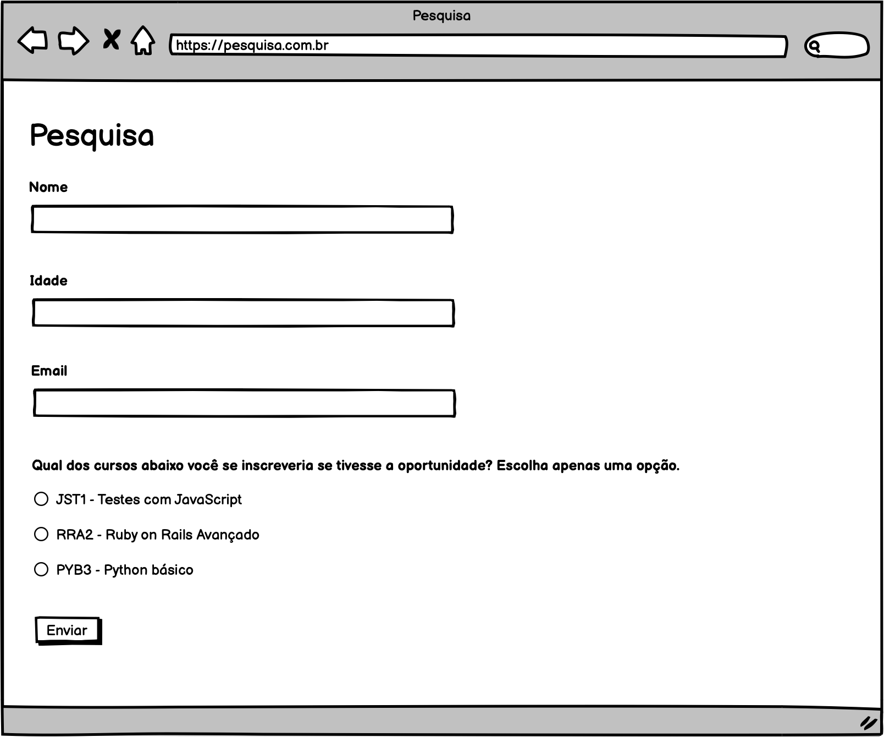

# Pesquisa

Você trabalha como desenvolvedor de software em uma empresa importante no ramo de educação, e que é conhecida por fornecer cursos de tecnologia bastante relevantes no mercado. 

Sua empresa está considerando expandir sua carteira de cursos e possui algumas opções:

- JST1 - Testes com JavaScript
- RRA2 - Ruby on Rails Avançado
- PYB3 - Python básico

Para decidir qual será o próximo curso sua empresa optou por recorrer à uma pesquisa de mercado, a ser realizada diretamente com os possíveis interessados. Com isso, sua equipe foi acionada para criar o formulário de pesquisa que será utilizado para receber e validar estes dados.

Em conversa com os responsáveis, sua equipe foi capaz de levantar os seguintes requisitos referentes à pesquisa:

1. Todos os dados do formulário são obrigatórios.
2. As pessoas que responderem a pesquisa devem ter no mínimo 16 anos, já que esta será a idade mínima aceitável para os futuros alunos.
3. O e-mail deve ser válido. Uma validação simples é suficiente, que verifica apenas:
   3.1. Se o email possui o caractere '@'.
   3.2. Se o texto anterior ao '@' possui 2 ou mais caracteres.
   3.3 Se o texto posterior ao '@' possui pelo menos 3 caracteres.
4. Não é permitido responder à pesquisa optando por um curso diferente das 3 opções disponíveis.

Além disso, após a fase de coleta dos dados, algumas rotinas serão importantes para a tomada de decisão. São elas:

1. A quantidade total de interessados que responderam à pesquisa.
2. A quantidade de interessados que possui idade igual ou inferior a 16 anos.
3. A quantidade de interessados que possui idade superior a 16 anos.
4. O curso mais votado.
5. O curso menos votado.

Reúna-se com a sua equipe para planejar e construir um diagrama de classes que represente a solução para este problema. Pensem em quantas classes seriam necessárias, quais atributos e métodos vocês usariam e quais deles seriam públicos e quais seriam privados.

